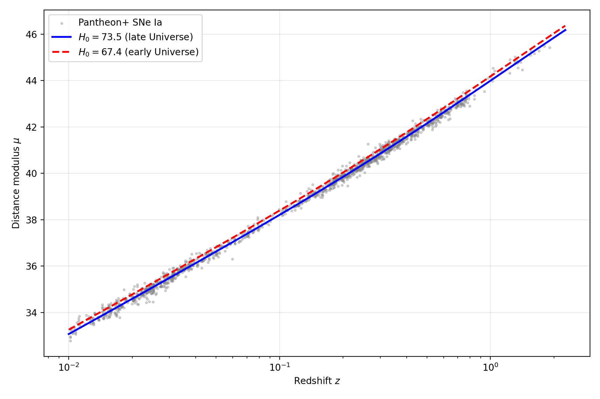
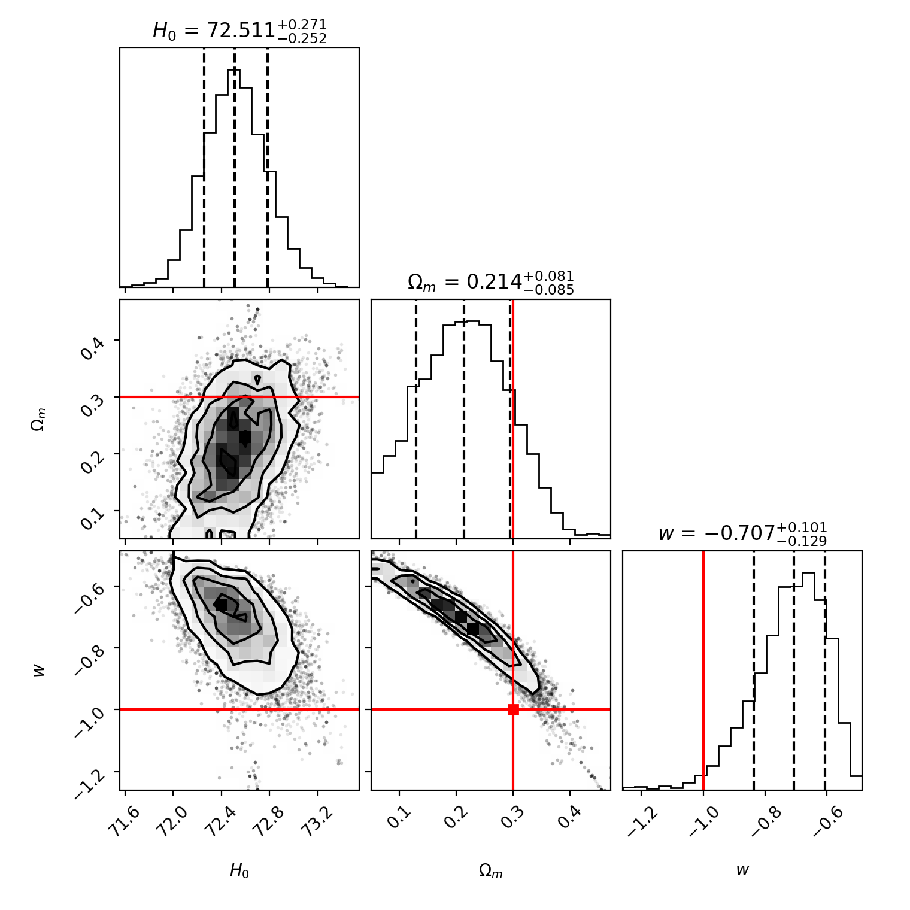

# Measuring H0 and Dark Energy Parameters from Pantheon+ Supernovae

Independent reproduction of the Hubble tension using the public Pantheon+ catalogue
of 1701 Type Ia supernovae.

## Results
| Quantity | This work | Published |
|---|---|---|
| H0 (late Universe) | 73.49 +- 0.12 km/s/Mpc (stat. only) | 73.0 +- 1.0 (Riess et al. 2022) |
| Omega_m | ~0.35 | 0.334 +- 0.018 (Brout et al. 2022) |
| w (flat wCDM) | -0.71 (+0.10/-0.13) | consistent with -1 given w-Omega_m degeneracy |
| Isotropy | no significant anisotropy (40 axes) | - |

The late-Universe value is strongly discrepant with the early-Universe prediction
(67.4 +- 0.5 km/s/Mpc, Planck 2020), independently reproducing the Hubble tension.

## Method
- Full 1701x1701 statistical+systematic covariance matrix; chi2 = D^T C^-1 D
- Grid scan for H0; MCMC (emcee) for multi-parameter fits
- Hemispheric isotropy test; H0 in redshift shells

## Limitations
Quoted uncertainties are statistical only: calibration systematics of the SN Ia
absolute magnitude are not marginalized over, so the true error budget is larger.
Auxiliary tests use diagonal uncertainties. See the paper for full discussion.

## Data
Pantheon+ public release: https://github.com/PantheonPlusSH0ES/DataRelease

## Run
Open `analysis.ipynb` in Google Colab and run all cells.
